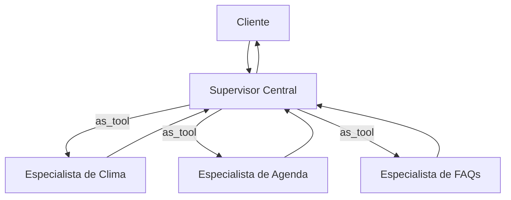
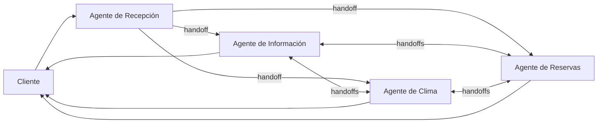
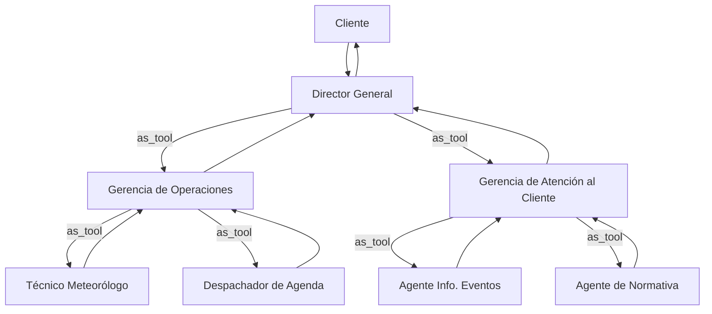

# Diagramas de arquitecturas multiagente

## 1. Arquitectura centralizada

Un único supervisor interpreta cada solicitud y llama a los especialistas como herramientas. Los especialistas no se comunican entre sí ni con el cliente.

## 2. Arquitectura descentralizada

La recepción solo dirige el primer mensaje. Después, los agentes pares son responsables de la conversación y pueden transferirla directamente mediante `handoffs`.

## 3. Arquitectura jerárquica

El Director General delega en dos gerencias; cada gerencia utiliza a sus especialistas operativos como herramientas.

